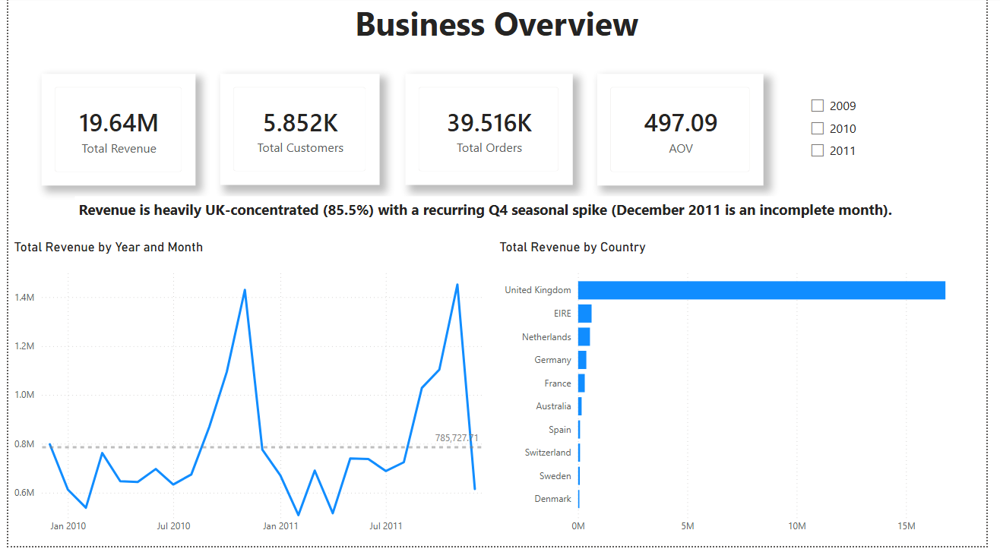
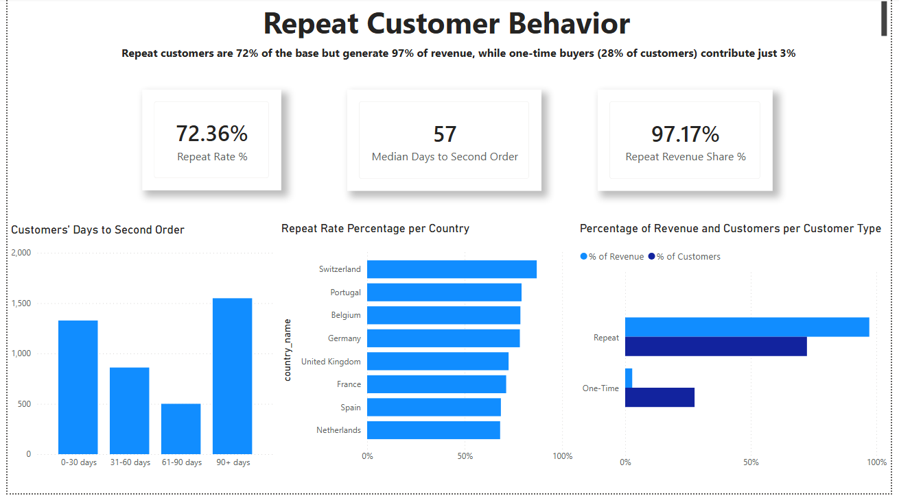
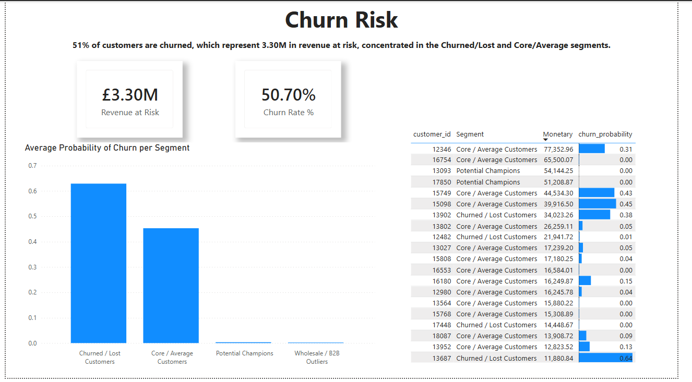

# End-to-End Retail Retention Analysis

An end-to-end analysis of about 1M transactions from a UK online retailer (December 2009 to December 2011). The project takes raw sales data through SQL Server, Python and Power BI to answer one question: **where does revenue come from, and how much of it is at risk?**

**Tools:** SQL Server (T-SQL) · Python (Jupyter) · Power BI (DAX)

**Start here:** [Video walkthrough (3 min)](https://youtu.be/I_UvFsbfLRI) · [One-page project brief (PDF)](Project%20Brief.pdf) · [Dashboard report (PDF)](power_bi/Retention_Analysis.pdf)

### At a glance

- **72% of customers are repeat buyers, and they generate 97% of revenue.** The median time to a second order is 57 days, so a follow-up around day 30 is the clearest lever.
- **51% of identified customers have gone quiet for 90+ days, holding £3.30M (17%) of historical revenue.** The 589 who lapsed 91 to 180 days ago are the most recoverable.
- **Revenue is concentrated:** the UK is 85.5% of sales and September to November is 29% of the year.

**Skills shown:** data profiling and cleaning in T-SQL · star-schema modelling and reporting views · RFM segmentation with K-Means · cohort retention analysis · logistic-regression churn scoring · DAX measures and a six-page Power BI dashboard · documenting assumptions and limits honestly.



## Key Findings

Between December 2009 and December 2011 the business generated **£19.64M** from **39,516 orders** and **5,852 identified customers** (average order value £497.09; the last month is partial).

| Area | Finding |
|---|---|
| **Revenue concentration** | The UK generates 85.5% of revenue (£16.80M). September to November delivers 29% of January to November revenue in both 2010 and 2011, and year-on-year growth is flat (+3.0%). |
| **Product catalog** | 22% of products (1,028 of 4,688) generate 80% of revenue. There is no single-product dependency: the top 10 products make up 8.0% of revenue. |
| **Repeat customers** | 72% of customers are repeat buyers, and they generate 97% of revenue. A repeat customer is worth about £3,900 in lifetime revenue against £344 for a one-time buyer. The median time to a second order is 57 days. |
| **Customer segments** | 42 customers (38 Potential Champions and 4 Wholesale/B2B accounts) hold 27% of identified revenue. The Lost segment is 34% of customers and 8.4% of revenue. |
| **Retention** | Retention peaks at about 22% in month 2, then erodes to about 18% by month 6. |
| **Churn** | 51% of customers (2,967) have not bought for 90+ days, holding £3.30M (17% of total revenue) in historical spend. |

### Recommendations

- **Diversify the market.** Expand Germany and France, assign account management to the Netherlands and EIRE, and use promotions to lift January to August sales.
- **Trim the long tail.** Audit the bottom 2,344 products (4.6% of revenue) to discontinue or bundle them.
- **Reactivate repeat buyers earlier.** Run a follow-up campaign around day 30 after a first order, with a reminder before day 57.
- **Protect the top accounts.** Assign dedicated account management to the 42 highest-value customers.
- **Prioritize win-back.** Rank outreach by churn probability and spend: the top 100 churned Core/Average customers first, then the 589 customers who lapsed 91 to 180 days ago.

These are hypotheses drawn from the data. None has been tested. See [Assumptions_and_Limitations.md](Assumptions_and_Limitations.md).

## Dashboard

The Power BI report has six pages: Business Overview, Products, Repeat Customer Behavior, Customer Segmentation, Cohort and Retention, and Churn Risk.

| | |
|---|---|
|  |  |

**Can't open Power BI?** The full six-page report is available as a PDF: [power_bi/Retention_Analysis.pdf](power_bi/Retention_Analysis.pdf).

A page-by-page walkthrough with the measures behind each visual is in [Report_Guide.md](Report_Guide.md).

## Project Overview

**Business problem:** How can the company use its transaction data to identify repeat customers, understand the variables behind repeat purchasing, and use these insights, together with top-selling product data, to improve marketing and operations strategy?

**Approach**

1. **SQL Server:** profile and clean the raw data, build a star schema, and create reporting views ([sql/](sql/)).
2. **Python:** RFM segmentation with K-Means clustering, cohort retention, and churn prediction ([python/](python/)).
3. **Power BI:** a six-page interactive dashboard on top of the SQL views and Python outputs ([power_bi/](power_bi/)).

## Repository Structure

```
End-to-End-Retail-Retention-Analysis/
├── README.md                        Project overview (this file)
├── Project Brief.pdf                One-page brief for business stakeholders
├── data_profiling.md                Profiling of the raw data
├── data_cleaning.md                 Cleaning steps and row counts
├── star_schema.md                   Star schema design and reporting layer
├── star_schema_diagram.png          Entity-relationship diagram
├── Business_Questions.md            Business questions, methods and findings
├── DAX_Measures.md                  Every DAX measure with formula and purpose
├── Report_Guide.md                  Page-by-page dashboard walkthrough
├── Assumptions_and_Limitations.md   Definitions, assumptions and limits
├── requirements.txt                 Python dependencies
├── LICENSE                          MIT license
├── sql/                             T-SQL scripts (profiling, cleaning, star schema, RFM, business questions)
├── python/                          Jupyter notebooks
│   ├── rfmcustseg.ipynb             RFM segmentation and K-Means clustering
│   ├── coh_ret_analysis.ipynb       Cohort retention
│   └── churn_regr.ipynb             Churn prediction
└── power_bi/                        Power BI report and dashboard screenshots
    ├── Retention_Analysis.pbix      Power BI report
    ├── Retention_Analysis.pdf       The same report exported as a PDF
    └── images/                      One screenshot per dashboard page
```

## Documentation

| Document | What it covers |
|---|---|
| [Project Brief.pdf](Project%20Brief.pdf) | One-page brief for stakeholders: bottom line, ranked actions, findings, and limits |
| [data_profiling.md](data_profiling.md) | Data quality profile of the raw dataset |
| [data_cleaning.md](data_cleaning.md) | Cleaning and transformation steps, with row counts |
| [star_schema.md](star_schema.md) | Fact and dimension tables, keys, the ER diagram, and the `rpt` reporting layer |
| [Business_Questions.md](Business_Questions.md) | Each business question, its method, and its finding |
| [DAX_Measures.md](DAX_Measures.md) | Every measure and calculated column, with formulas |
| [Report_Guide.md](Report_Guide.md) | The six dashboard pages and how to read them |
| [Assumptions_and_Limitations.md](Assumptions_and_Limitations.md) | Definitions, assumptions, and what the analysis cannot conclude |

## Dataset

- **Source:** [Online Retail II](https://archive.ics.uci.edu/dataset/502/online+retail+ii), UCI Machine Learning Repository, licensed CC BY 4.0. Donated by Daqing Chen.
- **Sheets:** two sheets, "Year 2009-2010" and "Year 2010-2011", combined into one table (one row per product line item within an invoice).
- **Size:** 43.5 MB, 1,067,371 rows across the two sheets. The sheets overlap in December 2010 (the second sheet starts in the month the first one ends), so 22,523 rows appear on both. One copy was removed when the sheets were combined, and the raw SQL table therefore holds 1,044,848 rows.
- **Columns:** Invoice, StockCode, Description, Quantity, InvoiceDate, Price, Customer ID, Country.

> `online_retail_II.xlsx` is excluded from version control through `.gitignore` because of its size. Download it from the link above and place it in the project root before running any scripts.

## Definitions and Assumptions

The full list is in [Assumptions_and_Limitations.md](Assumptions_and_Limitations.md). The key ones:

- Invoices starting with "C" are cancellations or returns and are excluded from revenue and repeat-purchase calculations.
- Guest checkouts (no Customer ID, 13.1% of revenue) are excluded from customer-level metrics.
- A **repeat customer** has two or more distinct, non-cancelled invoices.
- A customer is **churned** after 90 or more days without a purchase.
- Prices are unit selling prices in GBP. There is no cost data, so margin and profitability are out of scope.

## Reproducing the Project

### Environment
- SQL Server 2025 Express
- SQL Server Management Studio 22.9.5
- Python 3 with the packages in `requirements.txt`
- Power BI Desktop 2.156.951.0 64-bit (July 2026) or later

### Steps

1. **Get the data.** Download `online_retail_II.xlsx` (see [Dataset](#dataset)).
2. **Run the SQL scripts** in [sql/](sql/) in numbered order, from `01_data_profiling.sql` through `04_rfm_table.sql`. `05_business_questions.sql` holds the analysis queries.
3. **Set up Python:**
   ```bash
   python3 -m venv venv
   source venv/bin/activate       # Windows: venv\Scripts\Activate.ps1
   pip install -r requirements.txt
   ```
4. **Run the notebooks** in [python/](python/): RFM and K-Means clustering, cohort retention, and churn prediction.
5. **Open the dashboard** in [power_bi/](power_bi/) with Power BI Desktop.

### Connecting Power BI to your own database

1. In Power BI Desktop, go to **Home → Get Data → SQL Server**.
2. Enter your server (for example `localhost\SQLEXPRESS`) and your database name.
3. Choose **Import** mode. DirectQuery is unnecessary at this data size.
4. Choose **Windows authentication**.
5. Select the reporting views and tables, then click **Load**.

The report was built with Windows authentication, so it stores no passwords or credentials. If you share your own copy, clear stored credentials first (File → Options and settings → Data source settings).

## About the author

Built by **Giannis Psomas**, using SQL Server, Python and Power BI to turn raw transaction data into retention insights and recommendations. Questions or feedback are welcome.

- LinkedIn: [giannis-psomas](https://www.linkedin.com/in/giannis-psomas/)
- GitHub: [giannispsomas](https://github.com/giannispsomas)

## License

The code in this repository is released under the [MIT License](LICENSE). The dataset is not included; it is licensed separately under CC BY 4.0 by its authors (see [Dataset](#dataset)).
