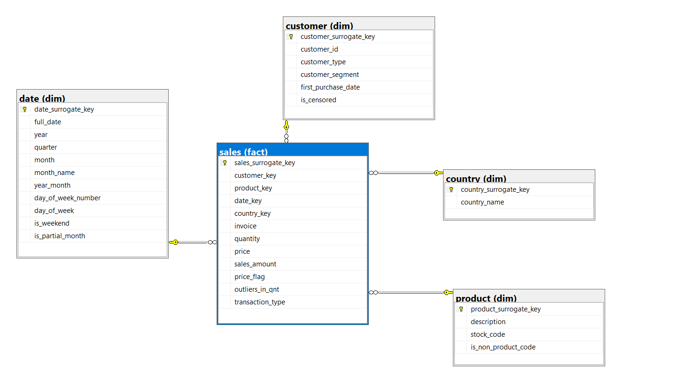

# Star Schema Build

## Overview

- **Source table:** `dbo.online_retail_II_clean` (cleaned working table, see [data_cleaning.md](data_cleaning.md))
- **Target database:** `OnlineRetailII`
- **Schemas:** `dim` (dimension tables) and `fact` (fact table)
- **Tool:** SQL Server (T-SQL)
- **Method:** Kimball four-step dimensional design (business process, grain, dimensions, facts)
- **Purpose:** turn the cleaned, row-level transaction table into a queryable star schema for reporting and analysis
- **Source row count:** 1,026,237
- **Fact table row count:** 1,026,237

## Dimensional Design

### Step 1: Business process

Sales transactions, recorded through invoices.

### Step 2: Grain

**One row in the fact table is one invoice line item.**

11,144 `(invoice, product)` pairs appear on more than one line. The source has no line-item number, and deduplication only removes rows that are identical in every column, so an invoice can list the same product twice at different quantities or prices. Order-level counts must use `COUNT(DISTINCT invoice)`, never `COUNT(*)`.

### Step 3: Dimensions

| Dimension | Attributes |
|---|---|
| `dim.customer` | Customer_ID, CustomerType, CustomerSegment, first_purchase_date, IsCensored |
| `dim.product` | Description, StockCode, IsNonProductCode |
| `dim.date` | FullDate, Year, Quarter, Month, MonthName, YearMonth, DayOfWeekNumber, DayOfWeek, IsWeekend, IsPartialMonth |
| `dim.country` | Country |

`Invoice` is a **degenerate dimension**. It has no descriptive attributes of its own, so it stays on the fact table and does not get a dimension table.

**Country has its own dimension.** In the first design, Country lived only on `dim.customer`, so a guest transaction (no Customer_ID) had no country and fell back to the Unknown member. That put about 22% of fact rows, nearly all UK, under "Unknown" in any country report. `dim.country` is now looked up independently for each fact row from `_clean.Country`, so guest sales keep their real country.

**IsCensored and first purchase date live on `dim.customer`.** Both describe a customer, not a single transaction. Storing them once per customer is more correct and cheaper than repeating them on every fact row.

### Step 4: Facts

| Measure | Additive? |
|---|---|
| `Quantity` | Additive |
| `Price` | **Non-additive.** Compute average price as `SUM(sales_amount) / SUM(quantity)`, never `AVG(price)`. |
| `SalesAmount` (`Quantity * Price`) | Additive |
| `Invoice` | Not a measure. It is a degenerate dimension kept for grain and traceability. |

---

## Physical Structure

### Design decisions

- Every dimension has a surrogate key: `int identity(1,1)` for `customer`, `product` and `country`. `date_surrogate_key` is a `yyyyMMdd` integer, because it is naturally unique and readable.
- Natural keys are kept next to the surrogate keys: `customer_id`, `stock_code`, `full_date` and `country_name`.
- Money columns (`price`, `sales_amount`) use `decimal(18,4)`, never `float`.
- Unknown members (key `-1`) exist in `dim.customer`, `dim.product` and `dim.country`. `dim.date` does not need one, because dates are never missing or unmatched by construction.

### Schemas

```sql
if not exists (select 1 from sys.schemas where name = 'fact') exec('create schema fact');
if not exists (select 1 from sys.schemas where name = 'dim') exec('create schema dim');
```

### Dimension tables

```sql
create table dim.country (
    country_surrogate_key   int identity(1, 1) primary key,
    country_name            varchar(50) not null,
    constraint uniq_country_name unique (country_name)
);

create table dim.customer (
    customer_surrogate_key  int identity(1, 1) primary key,
    customer_id             int null,
    customer_type           varchar(20),
    customer_segment        varchar(20),
    first_purchase_date     date null,
    is_censored             bit null,
    constraint uniq_customer_id unique (customer_id)
);

create table dim.product (
    product_surrogate_key   int identity(1, 1) primary key,
    description             varchar(100),
    stock_code              varchar(20) not null,
    is_non_product_code     bit,
    constraint uniq_product_stock_code unique (stock_code)
);

create table dim.date (
    date_surrogate_key      int primary key,
    full_date               date not null,
    year                    smallint not null,
    quarter                 tinyint not null,
    month                   tinyint not null,
    month_name              varchar(10) not null,
    year_month              char(7) not null,
    day_of_week_number      tinyint not null,       -- 1 = Monday ... 7 = Sunday
    day_of_week             varchar(10) not null,
    is_weekend              bit not null,
    is_partial_month        bit not null
);
```

Notes on the dimensions:
- `dim.product.description` is `varchar(100)` to fit the longer names of the products restored by the corrected junk-Description rule (see [data_cleaning.md](data_cleaning.md)).
- `dim.customer` does not carry a country (that moved to `dim.country`). `is_censored` and `first_purchase_date` are populated from the censoring lookup.
- `dim.date` includes `year`, `quarter`, `month`, `month_name`, `year_month` and `day_of_week_number` so Power BI's native time intelligence works.

### Fact table

```sql
create table fact.sales (
    sales_surrogate_key     bigint identity(1, 1) primary key nonclustered,
    customer_key            int not null,
    product_key             int not null,
    date_key                int not null,
    country_key             int not null,
    invoice                 varchar(20) not null,
    quantity                int not null,
    price                   decimal(18, 4) not null,
    sales_amount            decimal(18, 4) not null,
    price_flag              varchar(20),
    outliers_in_qnt         varchar(20),
    transaction_type        varchar(20) not null,
    constraint fk_sales_customer foreign key (customer_key) references dim.customer(customer_surrogate_key),
    constraint fk_sales_product  foreign key (product_key)  references dim.product(product_surrogate_key),
    constraint fk_sales_date     foreign key (date_key)     references dim.date(date_surrogate_key),
    constraint fk_sales_country  foreign key (country_key)  references dim.country(country_surrogate_key)
);
```

Notes on the fact table:
- `sales_surrogate_key` is `nonclustered` on purpose. It leaves the clustered slot free for a clustered columnstore index (see [Performance](#performance)).
- `price` is `decimal(18,4)`, not `decimal(10,2)`. Cleaning rounds Price to 3 decimals, and a `decimal(10,2)` column would silently round it again to 2. `price` and `sales_amount` (calculated at full precision as `quantity * price`) could then disagree by a fraction of a penny across a million rows.
- `country_key` is new. `is_censored` and `first_purchase_date` are not on this table. They live on `dim.customer`.

### Keys and constraints

| Type | Constraint | Definition |
|---|---|---|
| Foreign key | `fk_sales_customer` | `fact.sales.customer_key` → `dim.customer.customer_surrogate_key` |
| Foreign key | `fk_sales_product` | `fact.sales.product_key` → `dim.product.product_surrogate_key` |
| Foreign key | `fk_sales_date` | `fact.sales.date_key` → `dim.date.date_surrogate_key` |
| Foreign key | `fk_sales_country` | `fact.sales.country_key` → `dim.country.country_surrogate_key` |
| Unique | `uniq_customer_id` | `dim.customer.customer_id` |
| Unique | `uniq_product_stock_code` | `dim.product.stock_code` |
| Unique | `uniq_country_name` | `dim.country.country_name` |

The unique constraints on natural keys protect data quality and speed up lookups.

---

## Entity-Relationship Diagram

The star has `sales` (fact) at the center. `date`, `customer`, `product` and `country` (dimensions) each connect to it through one foreign key, one-to-many from each dimension into the fact table.



## Unknown Members

| Dimension | Surrogate key | Natural key | Descriptive attributes |
|---|---|---|---|
| `dim.customer` | -1 | `NULL` | CustomerType = `'Guest/Unregistered'`, CustomerSegment = `'N/A'` |
| `dim.product` | -1 | `'UNKNOWN'` | Description = `'Unknown Product'`, IsNonProductCode = 0 |
| `dim.country` | -1 | n/a | country_name = `'Unknown'` |

They are inserted with `set identity_insert ... on/off`, so the surrogate key `-1` can be forced in despite the `identity` column.

## Dimension Population

| Dimension | Rows loaded | Method |
|---|---|---|
| `dim.customer` | 5,924 (5,923 registered plus the unknown member) | `select distinct customer_id, customer_type, customer_segment` where `customer_id is not null`, left-joined to the censoring lookup for `first_purchase_date` and `is_censored` |
| `dim.product` | 4,751 (4,750 products plus the unknown member) | `select distinct description, stock_code, is_non_product_code` where `stock_code is not null` |
| `dim.country` | 44 (43 countries plus the unknown member) | `select distinct country_name` from the clean table |
| `dim.date` | 739 | Recursive CTE that generates every calendar day between `min(invoicedate)` and `max(invoicedate)`, so the calendar has no gaps whether or not a day had sales |

## Fact Table Population

```sql
insert into fact.sales (
    customer_key, product_key, date_key, country_key,
    invoice, quantity, price, sales_amount,
    price_flag, outliers_in_qnt, transaction_type
)
select
    isnull(cust.customer_surrogate_key, -1),
    isnull(pr.product_surrogate_key, -1),
    convert(int, convert(char(8), cl.InvoiceDate, 112)),
    isnull(co.country_surrogate_key, -1),
    cl.Invoice,
    cl.Quantity,
    cast(cl.Price as decimal(18, 4)),
    cl.Quantity * cast(cl.Price as decimal(18, 4)),
    cl.PriceFlag,
    cl.OutliersInQnt,
    cl.TransactionType
from dbo.online_retail_II_clean cl
left join dim.customer cust on cust.customer_id = cl.Customer_ID
left join dim.product pr    on pr.stock_code = cl.StockCode
left join dim.country co    on co.country_name = cl.Country;
```

- `left join` on every dimension (not `inner join`), so unmatched source rows still reach the fact table.
- `isnull(..., -1)` routes an unmatched row to the Unknown member instead of dropping it or failing.
- Joins use natural keys only (`stock_code`, `customer_id`, `country_name`). Each of those columns is `unique` in its dimension, so a compound join is unnecessary.
- The date key uses `convert(char(8), ..., 112)` instead of `format(..., 'yyyyMMdd')`, which is much faster over 1M+ rows.
- **1,026,237 rows affected.**

## Performance

```sql
create clustered columnstore index cci_fact_sales
on fact.sales;
```

The index is created after the fact table is fully loaded. Reporting queries on `fact.sales` are aggregation-heavy (`SUM`, `AVG` and `COUNT` grouped by dimension attributes) and not row-level lookups. Columnstore compresses better, reads only the columns a query touches, and enables batch-mode execution for aggregates.

---

## Validation

### Row count check

| Table | Row count |
|---|---|
| `dbo.online_retail_II_clean` (source) | 1,026,237 |
| `fact.sales` | 1,026,237 |

The counts match, so no rows were lost or duplicated in the load.

### Orphan checks (all must return 0)

| Dimension | Orphans | Verdict |
|---|---|---|
| `dim.customer` | 0 | PASS |
| `dim.product` | 0 | PASS |
| `dim.date` | 0 | PASS |
| `dim.country` | 0 | PASS |

### Unknown member counts

| Check | Count | Verdict |
|---|---|---|
| `fact.sales` rows with `customer_key = -1` | 228,452 | PASS. Matches the null-`Customer_ID` count in `online_retail_II_clean` exactly. |
| `fact.sales` rows with `product_key = -1` | 0 | PASS. The `stock_code` join to `dim.product` is fully reliable. |
| `fact.sales` rows with `country_key = -1` | 0 | PASS. Every row's Country matched a `dim.country` entry. |

### Valid-sales reconciliation

`fact.sales` keeps every transaction type (Sale, Cancellation, Stock Adjustment). `dbo.online_retail_II_fact` is the Sale-only subset built by the cleaning script. The two must agree when `fact.sales` is filtered the same way:

| Check | `dbo.online_retail_II_fact` | `fact.sales` filtered to Sale, product codes, Price > 0 |
|---|---|---|
| Row count | 1,003,352 | 1,003,352 |
| Revenue | £19,643,192.86 | £19,643,192.86 |

### Grain check

11,144 `(invoice, product_key)` pairs appear on more than one line. This confirms the grain is one invoice line item, not one product per invoice. Revenue totals are unaffected. Only `COUNT(*)` used as an order count would be wrong.

### Partial month check

```sql
select min(full_date), max(full_date), count(*) from dim.date where is_partial_month = 1;
```

The result is exactly 9 rows, from 2011-12-01 to 2011-12-09, which matches the last 9 days of the dataset.

### Spot check

`fact.sales` was joined to all four dimensions (`dim.date`, `dim.product`, `dim.customer`, `dim.country`), and the values were checked by eye across the star.

### Business query test

```sql
select
    dd.year Yr,
    pr.description ProductName,
    sum(fs.sales_amount) TotalSales
from fact.sales fs
inner join dim.date dd
    on fs.date_key = dd.date_surrogate_key
inner join dim.product pr
    on fs.product_key = pr.product_surrogate_key
group by
    dd.year,
    pr.description;
```

This confirms the schema supports a typical total-sales-by-year-and-product query from end to end.

---

## Data Dictionary (key columns)

| Table | Column | Type | Description |
|---|---|---|---|
| `dim.customer` | `customer_surrogate_key` | int | Internal primary key. `-1` is the unknown or unmatched customer. |
| `dim.customer` | `customer_id` | int, nullable | Natural key from the source. `NULL` for the unknown member. |
| `dim.customer` | `first_purchase_date` | date, nullable | Earliest Sale date. `NULL` for guests and customers with no Sale row. |
| `dim.customer` | `is_censored` | bit, nullable | `NULL` for guests and customers with no Sale row. |
| `dim.product` | `product_surrogate_key` | int | Internal primary key. `-1` is the unknown or unmatched product. |
| `dim.product` | `stock_code` | varchar(20) | Natural key from the source. |
| `dim.country` | `country_surrogate_key` | int | Internal primary key. `-1` is the unknown or unmatched country. |
| `dim.country` | `country_name` | varchar(50) | Natural key from the source. |
| `dim.date` | `date_surrogate_key` | int | `yyyyMMdd` integer, also the natural business key. |
| `fact.sales` | `sales_surrogate_key` | bigint | Internal primary key. `nonclustered` to leave room for the columnstore index. |
| `fact.sales` | `invoice` | varchar(20) | Degenerate dimension. The invoice number stays on the fact row. |
| `fact.sales` | `sales_amount` | decimal(18,4) | `quantity * price`, calculated at load time (not stored in the source). |
| `fact.sales` | `customer_key`, `product_key`, `date_key`, `country_key` | int | Foreign keys to each dimension. `-1` where the source data was missing or unmatched. |

## Source-to-Target Mapping (fact table)

| Source column (`online_retail_II_clean`) | Target column (`fact.sales`) | Transformation |
|---|---|---|
| `Invoice` | `invoice` | Direct copy |
| `InvoiceDate` | `date_key` | `convert(char(8), ..., 112)` to int, matched to `dim.date` |
| `Customer_ID` | `customer_key` | Looked up in `dim.customer` on `customer_id`. `-1` if unmatched. |
| `StockCode` | `product_key` | Looked up in `dim.product` on `stock_code`. `-1` if unmatched. |
| `Country` | `country_key` | Looked up in `dim.country` on `country_name`. `-1` if unmatched. |
| `Quantity` | `quantity` | Direct copy |
| `Price` | `price` | Cast to `decimal(18,4)` |
| `Quantity`, `Price` | `sales_amount` | `Quantity * Price`, calculated at full precision |
| `PriceFlag` | `price_flag` | Direct copy |
| `OutliersInQnt` | `outliers_in_qnt` | Direct copy |
| `TransactionType` | `transaction_type` | Direct copy |
| `IsCensored`, first Sale date | `dim.customer.is_censored`, `dim.customer.first_purchase_date` | Computed once per customer through the censoring lookup, not copied onto every fact row |

## Maintenance

**Load strategy: full refresh.** The source is a static historical extract, not a live feed, so the schema is rebuilt and reloaded from scratch on each run instead of loading incrementally.

## Lessons

- **`dim.customer.customer_id` was too restrictive.** It was created `not null`, but the unknown member needs `customer_id = NULL`. Fixed with `alter table dim.customer alter column customer_id int null;` before inserting the unknown row.
- **`dim.product.description` was too short.** It was created as `varchar(20)`, which is too small for real descriptions (`Msg 2628`, truncation on load). Fixed with `alter table dim.product alter column description varchar(100);` before populating.
- **The fact insert had a column and select order mismatch.** An early `fact.sales` insert listed the `select` columns in a different order from the `insert into (...)` list. SQL Server matches by position, not name, so several columns silently landed in the wrong place. The mistake only surfaced when a text value (`PriceFlag = 'Normal'`) hit an `int` column and raised a conversion error. Fixed by making the `select` order match the `insert` list exactly.
- **`sales_amount` was left out of the insert.** The column is `not null` with no default, and an early insert omitted it, so SQL Server tried and failed to insert `NULL`. Fixed by adding `cl.Quantity * cl.Price` to both the column list and the select.
- **Country could only live on `dim.customer`.** Guest transactions have no `Customer_ID`, so they could not carry a country and fell back to the Unknown member. About 22% of rows, mostly UK, silently dropped out of any country-level report. Splitting country into `dim.country`, looked up independently for each fact row, fixed this without changing the grain.
- **`price` was too imprecise.** `decimal(10,2)` silently re-rounded the cleaning script's 3-decimal prices, so `price` and `sales_amount` could disagree at the sub-penny level across a million rows. Widened to `decimal(18,4)`.
- **The table design anticipates the columnstore index.** Declaring the fact table's primary key as `nonclustered` up front avoids dropping and recreating it later, because a table can only have one clustered index and the columnstore index needs that slot.
- **Validate unknown members, do not assume them.** Comparing the `fact.sales` rows with `customer_key = -1` to the null-`Customer_ID` count in the clean table (not just checking that the orphan count is 0) confirmed the unknown-member logic catches exactly the missing-data cases and nothing else. This is a stronger test than the orphan check alone. The same comparison was applied to `country_key = -1`.
